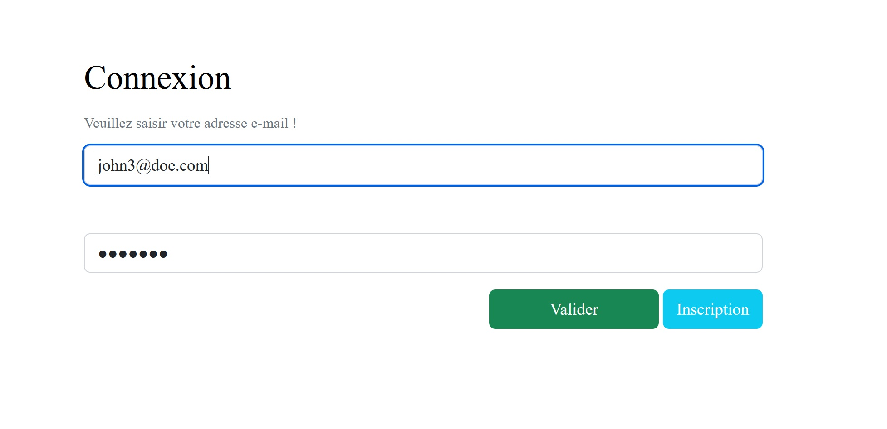
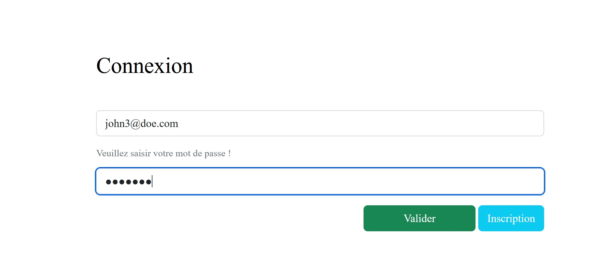
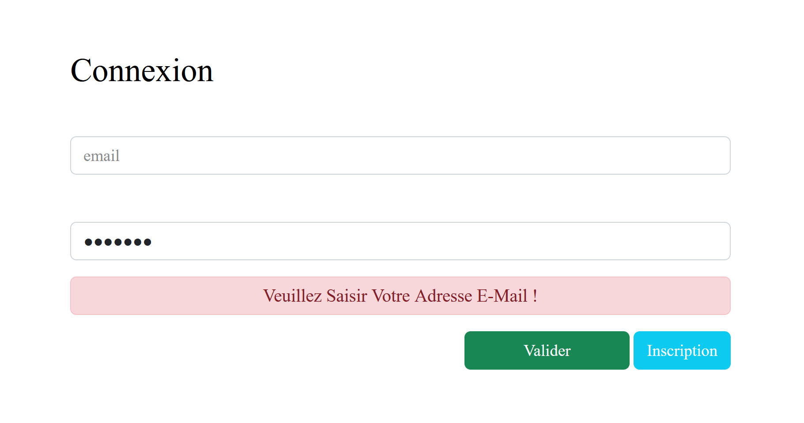
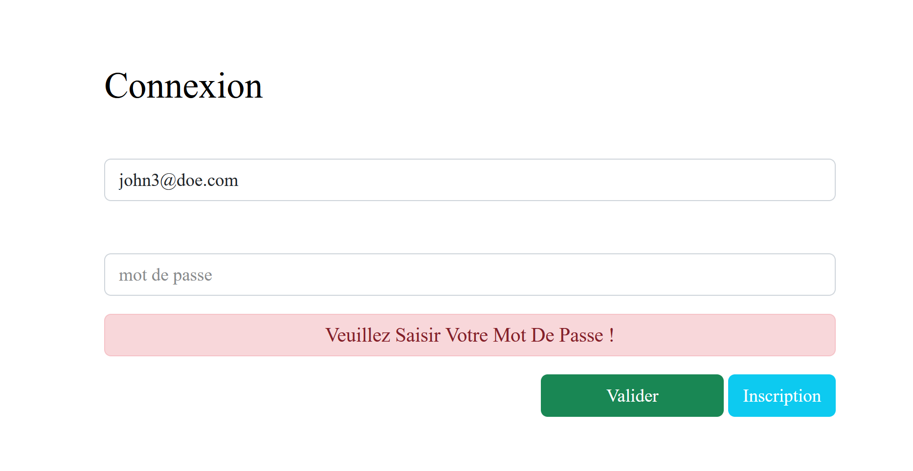

# Exercice 1 : gestion des événements sur le formulaire de connexion

---

## Modalités

- **Ne pas modifier le HTML ou CSS directement**.
- **Dans la page index.html fournit, vous devez uniquement insérer le lien vers votre script JavaScript à l'aide de la balise `<script>` comme vous avez l'habitude de faire**.
- **Toutes les modifications doivent se faire à travers JavaScript**.
- **Lancer votre code à l'aide de l'extension live server de Visual Studio Code**
- Récupérez depuis le dossier ressources le zip [src.zip](../ressources/src.zip) contenant les pages HTML et des feuilles de style CSS nécessaires à la réalisation de l'exercice.

---

## Enoncé

1. Depuis le fichier ***index.html***, affichez un message d'aide par l'intermédiaire de l'utilisation du paragraphe  HTML ayant la classe CSS `form-help` déjà présent dans le contenu de la page HTML de connexion. Ce message apparaît lorsqu'il y a l'événement *focus ou input* sur le champ de saisie afin d'aider l'utilisateur à remplir correctement l'information attendue. 
2. Lorsque l'utilisateur n'a plus le focus sur ce champ (événement *blur*), le message doit être caché ou supprimé de la page.

Vous trouverez ci-après des exemples de cas d'utilisation à travers les scénarios ci-dessous et des illustrations

### Scénarios

#### Scénario 1

En tant qu'utilisateur ;
Lorsque, j'ai le focus sur le champ e-mail ;

Alors, le message d'aide suivant devrait apparaître au-dessus du champ e-mail ***"Veuillez saisir votre adresse e-mail";***

---

#### Scénario 2

En tant qu'utilisateur ;

Lorsque, j'ai le focus sur le champ mot de passe ;

Alors, le message d'aide suivant devrait apparaître au-dessus du champ de mot passe "Veuillez saisir votre mot de passe" ;

---

#### Scénario 3

En tant qu'utilisateur ;

Lorsque, je perds le focus sur le champ e-mail ;

Alors, le message d'aide "veuillez saisir votre adresse e-mail" devrait disparaître ;

---

#### Scénario 4

En tant qu'utilisateur ;

Lorsque, je perds le focus sur le champ mot de passe ;

Alors, le message d'aide "veuillez saisir votre mot de passe" devrait disparaître ;

---

#### Scénario 5

En tant qu'utilisateur ;

Lorsque, je ne remplis pas l'e-mail ou le mot de passe ;

Et que je demande à soumettre le formulaire ;

Alors, le message d'alert associé au champ manquant devrait apparaître;
Et la soumission du formulaire devrait être bloquée.

**PS** 

- Ici, il faut utiliser l'événement submit sur le bouton de soumission
- Le message doit apparaître au-dessus du formulaire.
- L'élément parent contenant le message doit avoir la classe CSS `alert alert-danger`.

---

---

## Scénario 6

En tant qu'utilisateur ;

Lorsque, je remplis l'e-mail et le mot de passe ;

Et que je demande à soumettre le formulaire ;

Alors, je devrais pouvoir le faire;

Et il ne devrait plus avoir le message "email et/ou mot de passe obligatoires" ;
