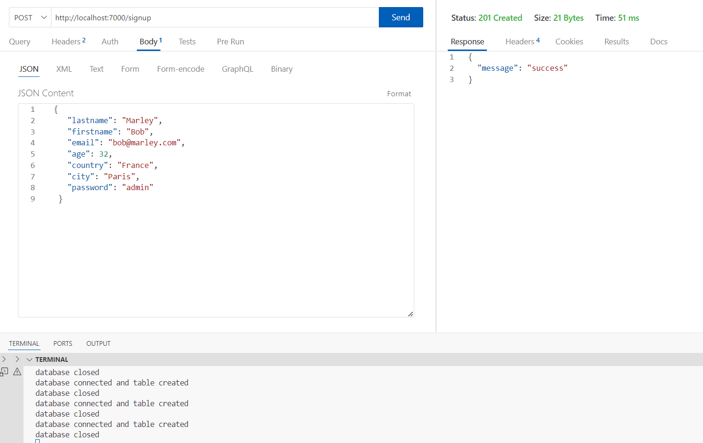

# Correction exercice 13

## Installation

- `npm install`

## Lancement de l'application

- `node src/index.mjs`
- Ouvrir l'extension ThunderClient et ajoutez les données à envoyer en POST au serveur qui écoute sur le port 7000 depuis l'URL `http://localhost:7000/signup`

---

## Piste d'amélioration

Dans un but pédagogique pour montrer l'utilisation des événements, les fonctions ***emit()*** et ***on()*** sont utilisées à outrance. Il est tout à fait possible de simplifier le code en évitant la répétition et en faisant les calculs de l'inscription directement au sein du callback ***req.on('end')*** par exemple.