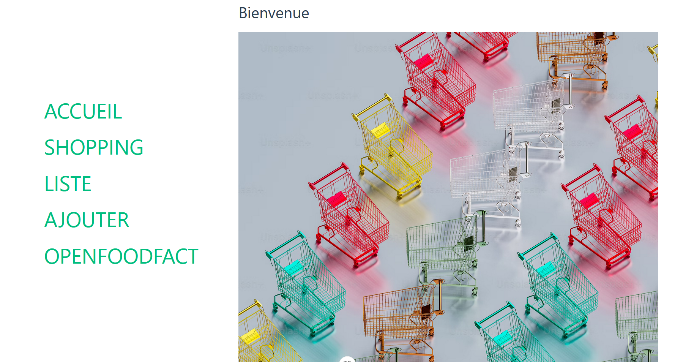
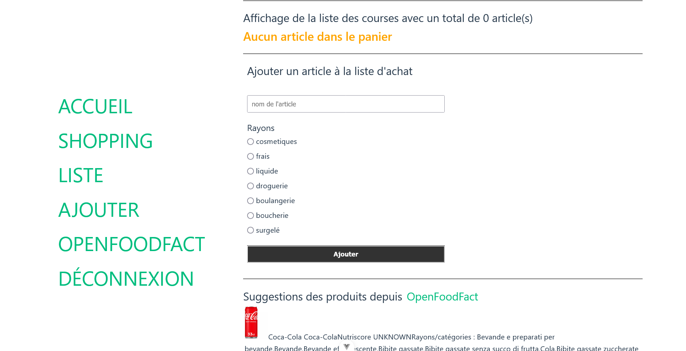
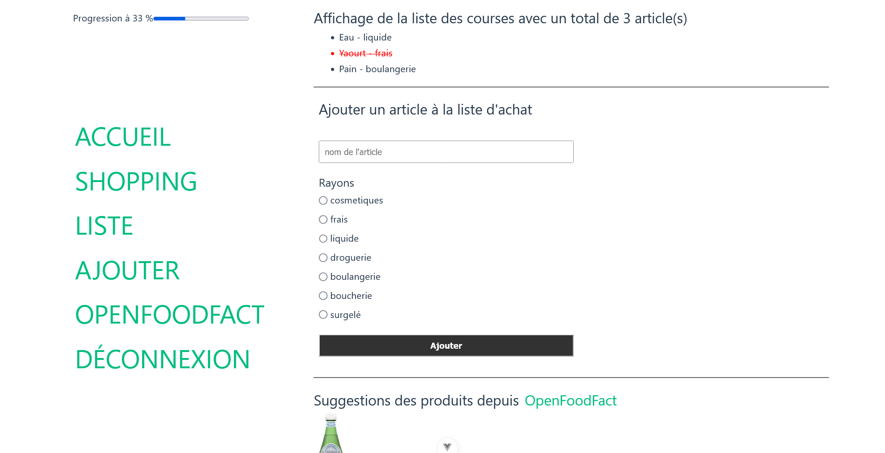
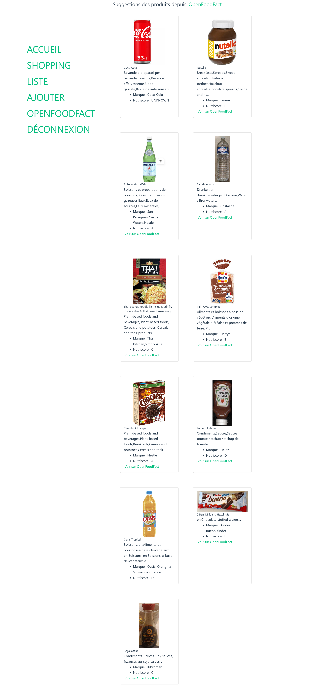
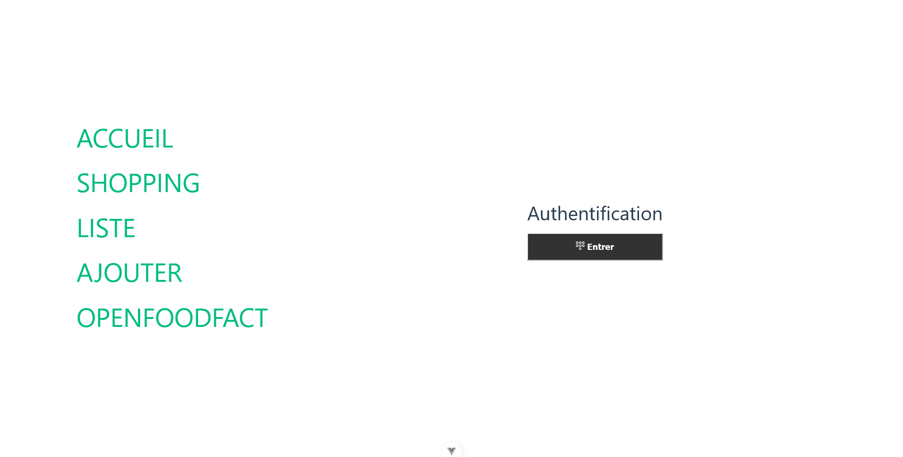

# TP Validation des acquis : liste de courses

---

## Objectif

Créez une application fullJS avec JavaScript, HTML et CSS en front-end et Node en back-end

---

## Pour faciliter la communication Front et Back

- Effectuez vos requêtes vers le back-end avec l'extension Visual Studio Code **`ThunderClient`** dans un premier pour gagner du temps lors du développement. Le lien entre le Front et le Back pourra être effectué une fois que votre code sera fonctionnel.
- Utilisez l'extension **`SQLite Viewer`** d'`alexcvzz` pour visualiser votre base de données (schéma et données).

---

## Enoncé

1. Créez une application Web permettant un utilisateur de réaliser une liste de courses à partir de *npm* et en installant les paquets (packages) nécessaires (sqlite si vous optez pour une base de données SQL embarqué, eslint, etc.).
2. Créez un serveur Web avec Node, ce dernier gère les requêtes de vos pages Web depuis le front et la base de données SQLite ou la lecture ou l'écriture de votre fichier JSON si vous n'avez pas opté pour une base de données SQLite.
3. Stockez les informations métiers (utilisateurs, articles, etc) dans une base de données SQLite ou un fichier JSON côté Back-end

---

## Spécifications techniques

1. Gérez l'ajout,lecture, modification et suppresion (opération CRUD : Create, Read, Update et Delete)d'un article
2. Gérez la récupération d'une suggestion de produit via l'API OpenFoodFact à partir de la liste des produits ci-après
3. Gérez l'inscription d'un utilisateur.
4. Gérez la connexion d'un utilisateur.

### Liste des produits OpenFoodFact

```js
const codes = [
  '3017620425035',
  '3274080005003',
  '5449000214911',
  '8002270014901',
  '7613034626844',
  '737628064502',
  '3228857000906',
  '87157215',
  '3124480191182',
  '80052760',
  '8715035110106'
]
```

---

## Aide utilisation de l'API OpenFoodFact

### Traitement depuis le front

- Pour faire des appels vers un serveur distant, vous pouvez utiliser la fonction native [fetch](https://developer.mozilla.org/fr/docs/Web/API/Fetch_API/Using_Fetch
) de VanillaJS (JavaScript native)
- [Exemple d'URL https://world.openfoodfacts.org/api/v3/product/***737628064502***.json](https://world.openfoodfacts.org/api/v3/product/737628064502.json), avec ***737628064502*** identifiant unique d'un produit. Il vous suffit de remplacer ***737628064502*** par l'indentifiant de votre choix existant dans la base de données d'OpenFoodFact.

### Traitement depuis le back

Similaire au front à la différence que fetch n'existe pas côté back-end à la place il faut créer un client Web [cf. demo WriteStream](../demo/8-node/fs/writestream.mjs)

---

## Aide utilisation de sqlite3

1. Installez *sqlite3* avec la commande `npm i sqlite3` : permet d'avoir une base de données SQL léger dans un fichier et donc embarqué dans l'application.
2. Créez un fichier avec une extension `.sqlite`, ce fichier est notre future base de données pour stocker les données.
3. Connectez-vous via votre code source à la base de données afin d'effectuer vos opérations (création des tables et ajout des tuples)

---

## Exemples non contractuels de l'application finale (vous êtes libre de faire ce que vous voulez tant que les cas d'utilisation sont respectés)



---



---



---



---

